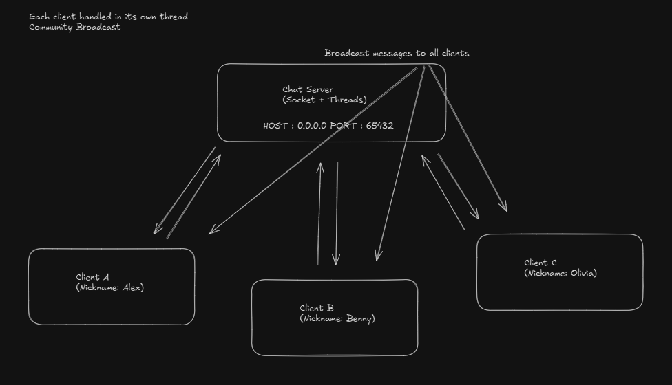

# Python Multi-Client Chat Server

- A lightweight, terminal-based community chat server written in Python.
Allows multiple clients to connect, choose nicknames, and exchange messages in real time over TCP.

---

## Features 

- Multi-client support using threading

- Nickname system — each client chooses their own name on join

- Broadcast messaging — send messages to everyone online

- Simple commands:

  - /list → see who’s online

  - /quit → disconnect from the server

- Thread-safe client handling

- Easy to run locally or over a LAN

---

## Requirements

- Python 3.8+

- Works cross-platform (Windows, macOS, Linux)

- No external dependencies — uses Python’s built-in socket and threading modules

---

## Installation

1. Clone the repository :
 - https://github.com/bax082024/Multi_Client_Chat-PY.git

2. Start the server :
  - python server.py

- By default, the server listens on:
  - HOST = 0.0.0.0
  - PORT = 65432

3. Start a Client :
  - python client.py

---

## How to use

1. When prompted, enter your nickname.

2. Type messages and press Enter to send.

3. Special commands:
  - `/list` = show all connected users
  - `/quit` = leave the chat

---

## Network Notes

1. To allow connections from other devices on your network:

  - Set **HOST** in server.py to your LAN IP (example:  192.168.1.100).
  - Ensure your firewall allows inbound traffic on the chosen **PORT**.

2. For internet access:

 - Port forward the server’s port on your router.
 - Use your public IP in **client.py**'s **SERVER_HOST**.

---

## Architecture

---

## Contact

For questions or feedback, please contact :
	- **bax082024@gmail.com**